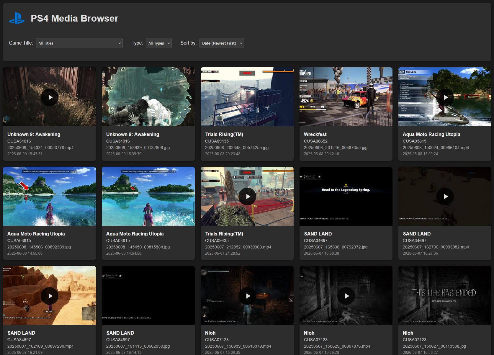

# PS4 Media Browser
A browser and exporter tool for viewing and exporting screenshots and clips on a hacked offline PS4 
 
> [!NOTE]  
> This project is a functioning and complete PoC 
> There are some things I'd like to improve but for now 
> "It just works"

## Why?
Well on a hacked PS4, you can't access PSN to upload screenshots and clips... 
So we need a way to do this without PSN. And imo this way is better as you can upload to any website now, not just PSN. 
And you can easily backup your content with out playing USB stick relay. 

## How to use
This tool was only tested with 9.03 fw running GoldHEN v2.4b18.3 
(It probs works on other fws, but untested. Unsure if the ftp structure is the same) 
1. Enable the FTP server in the GoldHEN settings -> Server settings
2. You should get a notification saying the FTP server is enabled and on what IP, take a note of this IP.
3. Now open the `config.ini` and edit `host` var with your IP.
4. Run the `main.go` script or the prebuilt `ps4mb-win(x64).exe` and your web browser should automatically open to `http://localhost:8080` If it doesn't, you can do it manually.
5. Now you will get a little content loading dialog, please wait at least 30 secs for content to be loaded, the more screenshots and videos you have, the longer it will take. TODO: add a loading counter
6. Now you can just click on content you want to view, copy to clipboard to paste screenshots into chat, or download your content to upload it manually to anywhere you like.
7. you can also filter by game, media type, date or a combo of any of these.
